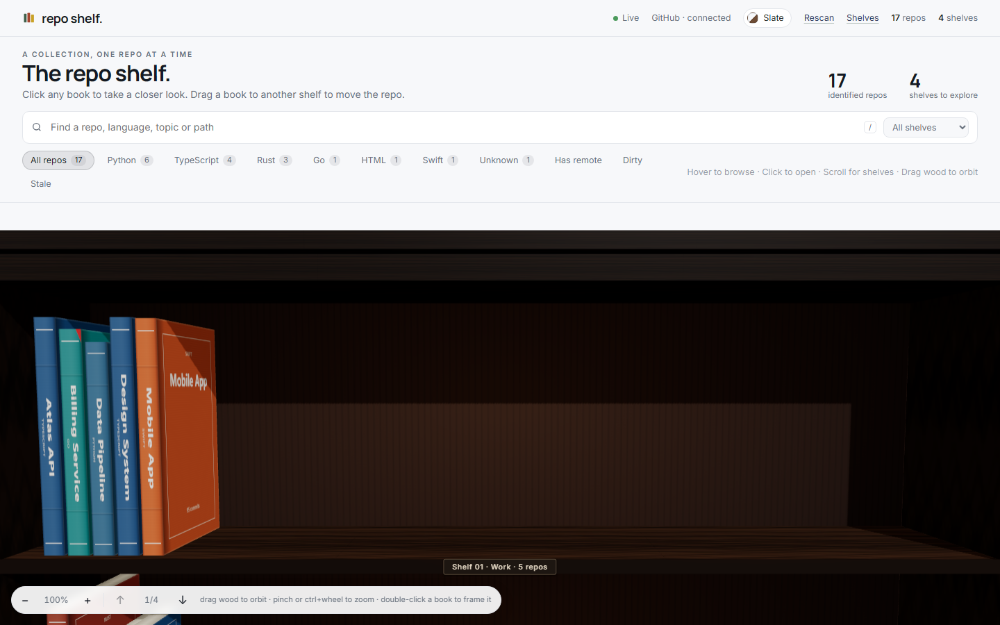
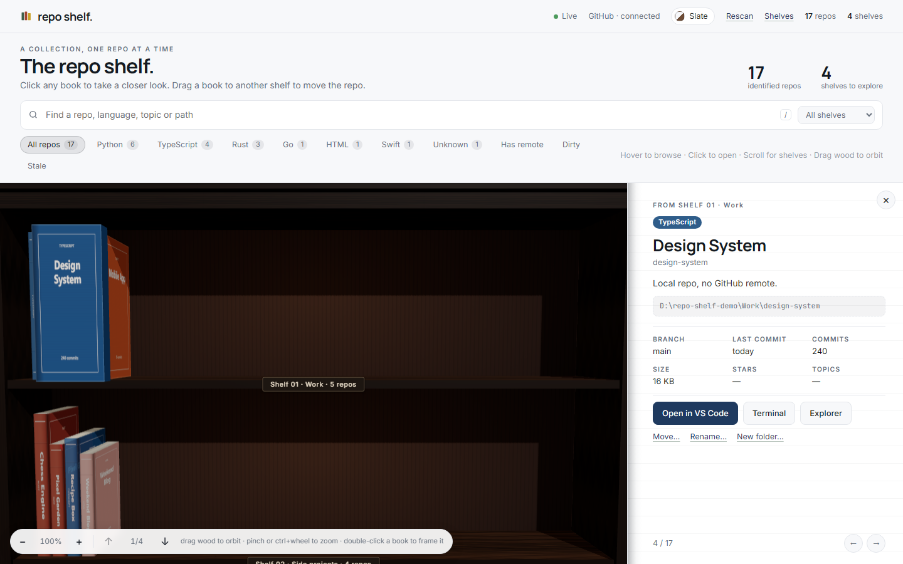
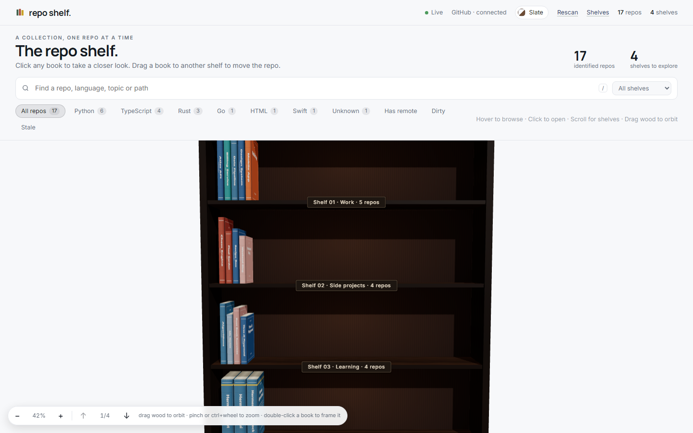
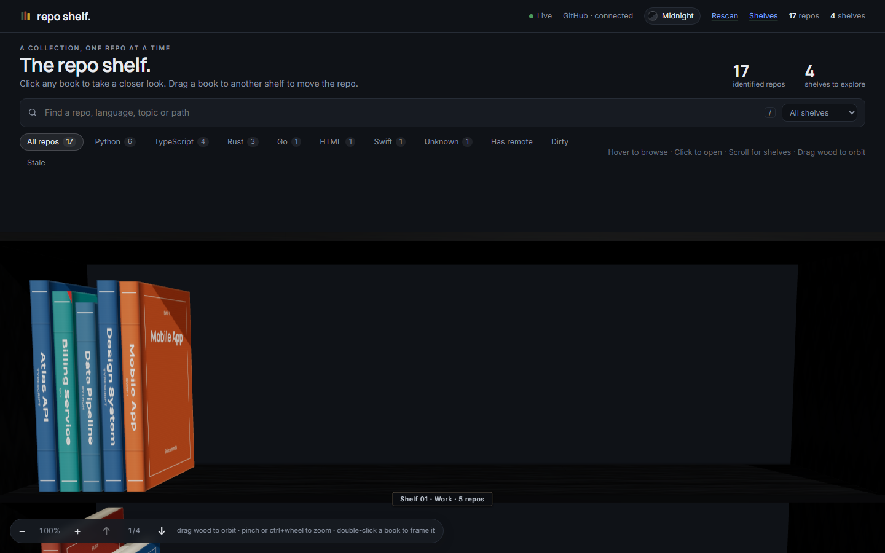
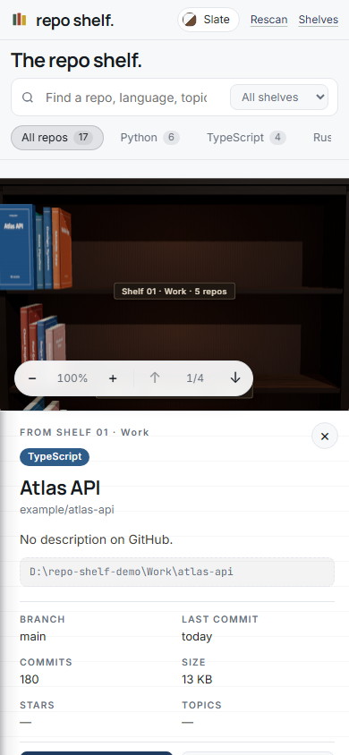

# repo shelf.

[](https://github.com/BkashJEE/repo-shelf/actions/workflows/ci.yml) [](LICENSE)

Your git repos as books on a 3D bookshelf. Every root folder you configure is a shelf, every git repo inside it is a book. Hover to browse, click to open, zoom and orbit the case, drag a book to another shelf to move the repo on disk.

Built with React Three Fiber, Express, and `gh`. Runs on your machine only. Windows, macOS and Linux.



| Open a book (page beside the shelf) | Zoomed out, every shelf | Midnight theme, modern case | Phone |
| --- | --- | --- | --- |
|  |  |  |  |

## What a book tells you

| Visual | Meaning |
| --- | --- |
| Spine height | Commit count (log scale) |
| Spine thickness | Size on disk excluding `.git`, `node_modules`, build output |
| Spine color | Primary language (GitHub language when available, otherwise a file-extension guess) |
| Faded, washed-out color | Stale: no commit in the last 90 days (configurable) |
| Gold band near the top | Repo has GitHub stars |
| Red tab at the top corner | Uncommitted changes |
| Yellow dot at the bottom | git could not read the repo |
| Dotted outline, "GITHUB ↗" | A link book: lives on a link shelf, not on disk yet |

## Actions

From the detail panel or by dragging:

- **Move** a repo to another shelf. Moves the folder on disk. Refuses if the name already exists there, and warns when the repo has uncommitted changes.
- **Rename** a repo. Renames the folder. Optionally also renames it on GitHub and updates `origin` when the repo is owned by your `gh` account.
- **New folder** inside a repo, with an optional `.gitkeep`. Paths are confined to the repo.
- **Open** in VS Code, a terminal (Windows Terminal, Terminal.app, or your Linux default), the file manager, or the GitHub page.
- **Clone** a link book onto any of your shelves with `git clone`.

Every action is logged to `.cache/actions.log`. Nothing is ever deleted.

## Run it

Requirements: Node 24, git. Optional: [GitHub CLI](https://cli.github.com/) logged in (`gh auth login`) for descriptions, stars, topics, and language.

```bash
npm install
npm run dev
```

Open http://127.0.0.1:5177. The API runs on http://127.0.0.1:4877 and only accepts local connections.

Production mode serves the built UI from the API server on one port:

```bash
npm run build
npm start
```

Then open http://127.0.0.1:4877.

## Link shelves and the secret shelf

A shelf can hold links instead of folders. Each link is a GitHub repo (`slug`) or any https URL, shown as a book with a dotted outline. Open it, or clone it onto a real shelf. The default config ships a **Hermes Agent** shelf with a few genuinely useful public repos.

There is also a hidden shelf. Type `hermes` anywhere in the app to reveal it.

```json
{ "label": "Reading list", "links": [{ "slug": "NousResearch/hermes-agent" }, { "name": "Docs", "url": "https://example.com/docs" }] }
{ "label": "Secret", "hidden": true, "links": [{ "slug": "you/your-private-skills" }] }
```

## Themes and bookcase styles

The theme button in the header switches colors (Slate, Library, Midnight, Nordic, Ink, Forest) and the bookcase build (Classic with back panel and crown, Modern slim, Floating planks). Both are remembered per browser.

## Configure shelves

`shelf.config.json` is created on first run:

```json
{
  "shelves": [
    { "label": "Developer", "path": "C:\\Users\\you\\Developer" },
    { "label": "Documents", "path": "C:\\Users\\you\\Documents" },
    { "label": "Home", "path": "C:\\Users\\you" }
  ],
  "staleAfterDays": 90,
  "githubCacheHours": 24
}
```

Shelf order in the file is shelf order on screen. Each folder shelf is scanned one level deep: every immediate sub-folder that contains `.git` becomes a book. Hidden folders are skipped. You can add and remove shelves from the **Shelves** button in the header. On macOS and Linux the default home shelves are `~/Developer`, `~/Documents`, and `~`.

Environment overrides: `SHELF_CONFIG` (config file path), `SHELF_CACHE` (cache directory), `SHELF_PORT` (API port).

## Keyboard

| Key | Action |
| --- | --- |
| `/` | Focus search |
| `Esc` | Clear search, close panel or dialog |
| `↑` `↓` or mouse wheel | Move between shelves |
| `ctrl` + wheel, trackpad pinch, `+` `-` | Zoom in / out (20% shows the whole case, 800% is nose-on-a-spine) |
| Drag on the wood, or right-drag anywhere | Orbit the bookcase |
| Double-click a book | Zoom right up to it |
| `0` or double-click the wood | Reset the view |
| `←` `→` | Previous / next repo while the panel is open |

## Tests

```bash
npm test          # server + derive unit tests (vitest, real temp git repos)
npm run test:e2e  # Playwright against fixture repos in a temp folder
```

## Layout

```
server/   Express API: config, scanner, GitHub enrichment, actions, SSE
src/      React + R3F UI: scene/ (bookcase, books, camera), ui/ (panel, dialogs), store, derive
tests/    vitest unit tests and Playwright e2e
docs/     design spec and implementation plan
```
